# MinHeap

Graph representation:

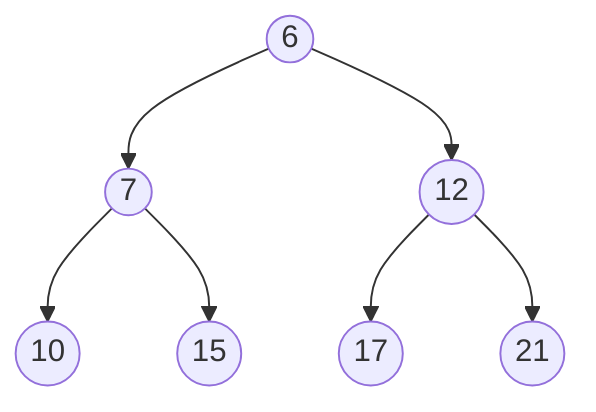

Array representation:

`[6, 7, 12, 10, 15, 17]`

## Insert
Insertion works by adding new node to bottom of the tree and heapifying it up.
Will compare recently added node (will be called current) to its parents. If any parent is smaller then current, swap it. Repeat until this condition is satisfied.

### Step 1: insert `5` at the bottom
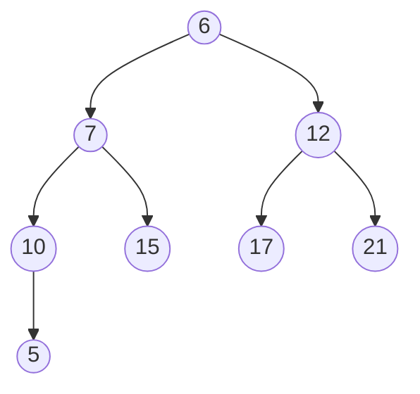
### Step 2: Compare with father node
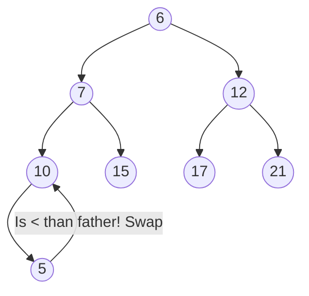
### Step 3: Swap

### Step 4: Compare with father node
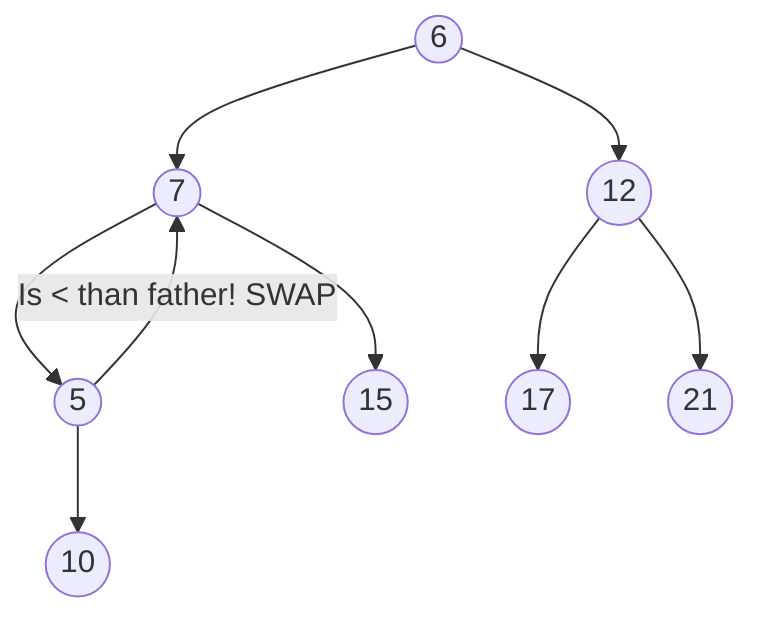
### Step 5: Swap

### Step 6: Compare with father node
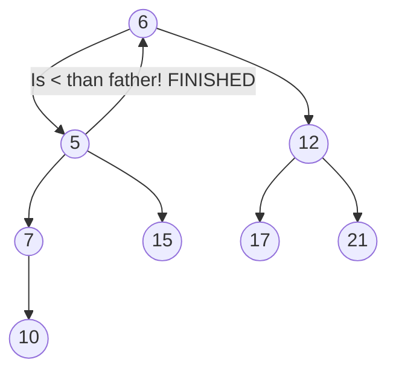
### Final result

## Delete
Deletion is done by removing the root node, putting the most recent added node to root's position and heapifying it down. Since the 2 level of the tree already contains the smallest values compared to the old root, one of those will be promoted to root. We need then to adjust its children to balance the tree.

### Step 1: Remove root
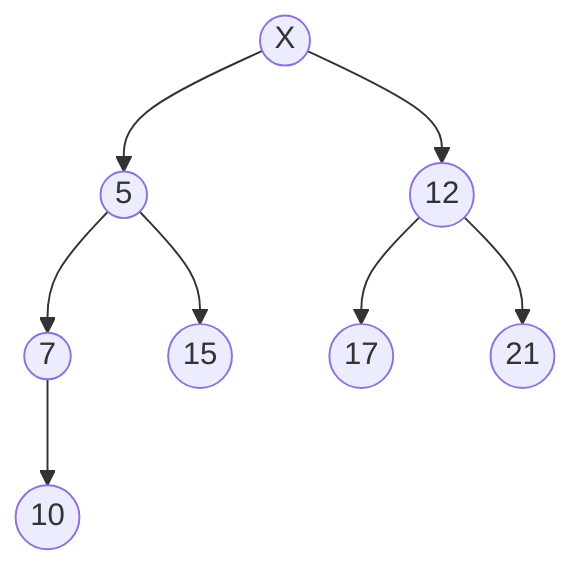
### Step 2: Swap last added node with root and call it current
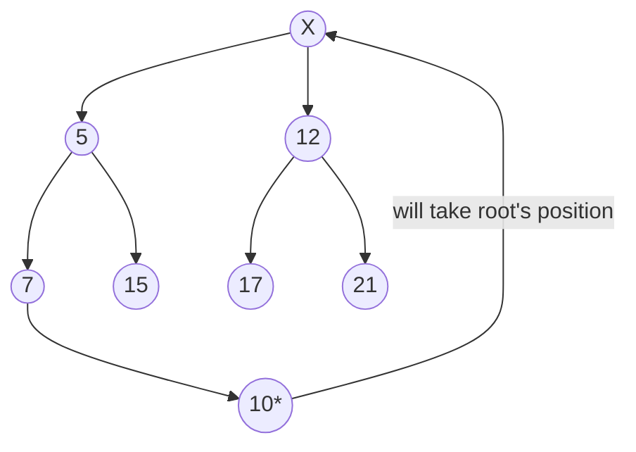
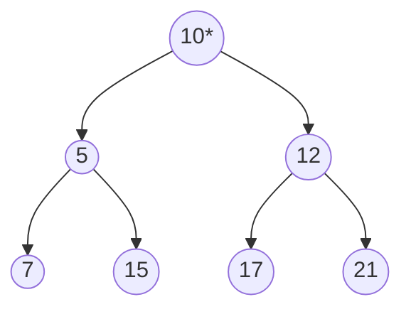
### Step 3: Pick the min() between children nodes and compare to current
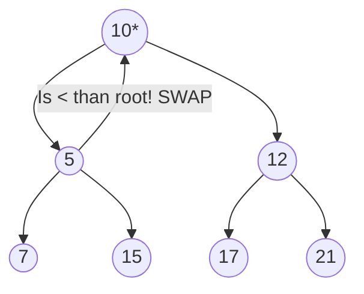
### Step 4: Swap
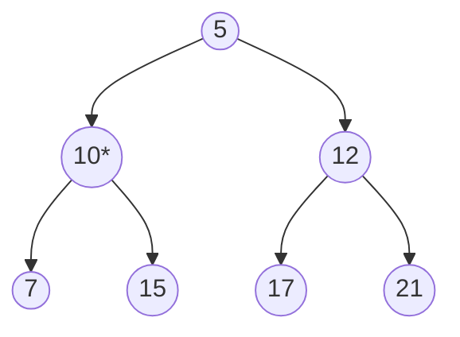
### Step 5: Compare current with its children, swap with the smallest
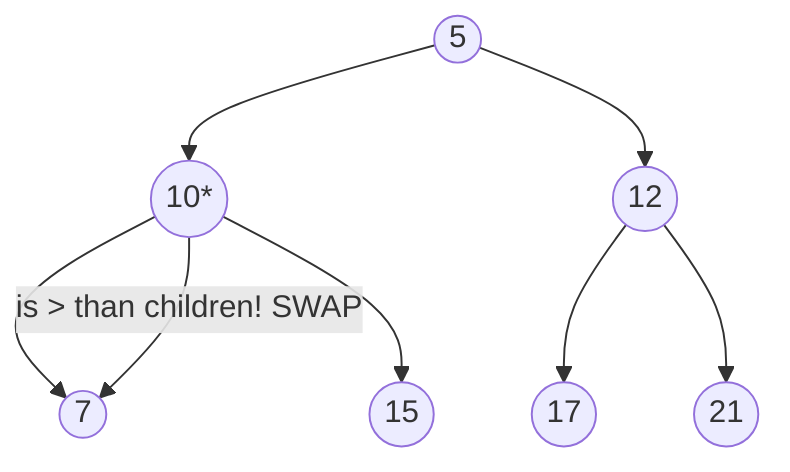
### Step 6: Swap
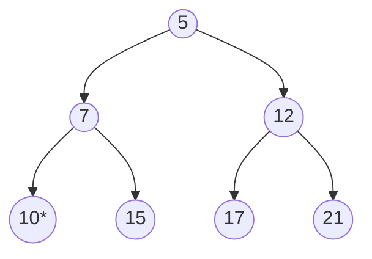
### Step 7: No children to compare. Final result

